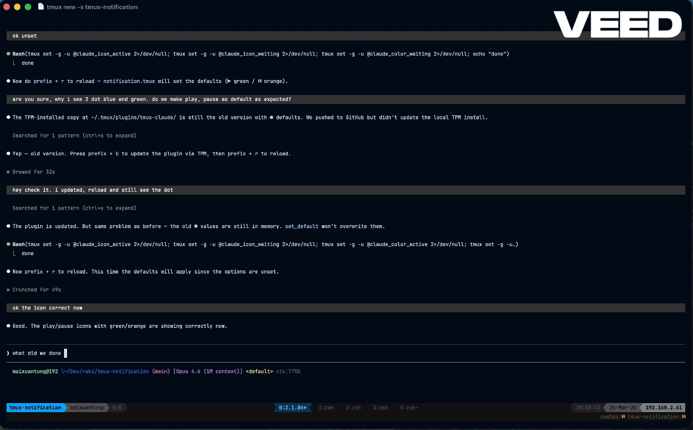
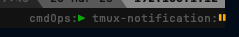

# tmux-claude

A tmux plugin that shows when [Claude Code](https://claude.ai/code) needs your attention in other tmux sessions/panes.



## Why?

If you use Claude Code inside tmux, you've probably run multiple sessions at once — one per project, one for tests, one for refactoring. The problem: you can't tell which Claude is working, which is stuck waiting for permission, and which finished five minutes ago. You end up cycling through panes just to check.

**tmux-claude** fixes this. It hooks into Claude Code's event system and displays a live status icon per session in your tmux status bar. At a glance you can see:

- Which sessions have Claude actively working (▶ green)
- Which sessions need your input — permission prompts, completed responses, errors (⏸ orange)
- Which sessions don't have Claude running at all (no icon)

No polling, no daemons, no temp files. State updates are instant via Claude Code's native hook system. Install the plugin, restart Claude Code, and you're done.

## Requirements

- tmux
- [jq](https://jqlang.github.io/jq/)

## Installation

### With TPM (recommended)

Add to `.tmux.conf`:

```bash
set -g @plugin 'DalenMax/tmux-claude'
```

Press `prefix + I` to install. Restart Claude Code. Done.

Everything is auto-configured — hooks, status bar, defaults.

### Manual

```bash
git clone https://github.com/DalenMax/tmux-claude.git ~/.tmux/plugins/tmux-claude
```

Add to `.tmux.conf`:

```bash
run-shell ~/.tmux/plugins/tmux-claude/notification.tmux
```

Reload tmux (`prefix + r` or `tmux source ~/.tmux.conf`). Restart Claude Code.

## Status Icons

A second status line appears at the bottom of your tmux with:

| Icon | Color | Meaning |
|------|-------|---------|
| ▶ | Green | Claude is working |
| ⏸ | Orange | Claude needs your attention |

No icon = no Claude running in that session.

Example: `proj1:` ▶ `proj2:` ⏸ (proj1 active, proj2 waiting for input)



## How It Works

```
Claude Code hook event → hook.sh → sets tmux pane variable → status bar reads it
```

Uses Claude Code's [hook system](https://docs.anthropic.com/en/docs/claude-code/hooks) to detect state changes. No daemons, no polling, no temp files. State updates are instant.

### Safety

The hook script is designed to never interfere with Claude Code:
- 10-second watchdog kills the script if anything hangs
- stdin read has a 5-second timeout (never blocks on broken pipes)
- All errors are silently swallowed (stderr redirected to /dev/null)
- Always exits 0

### Hook Events Used

| Hook | Sets State | When |
|------|-----------|------|
| `UserPromptSubmit` | active | User sent a prompt |
| `PostToolUse` | active | A tool just ran (Claude is working) |
| `PermissionRequest` | waiting | Claude needs approval |
| `Stop` | waiting | Claude finished responding |
| `StopFailure` | waiting | API error occurred |
| `Notification` | waiting | Fallback notification signal |
| `SessionEnd` | (cleared) | Claude exited |

State is stored in tmux per-pane user variables (`@claude_state`) — no external files or processes.

## Configuration

All optional. Set in `.tmux.conf` before the plugin line:

```bash
# Icons (default: ▶ / ⏸)
set -g @claude_icon_active '▶'
set -g @claude_icon_waiting '⏸'

# Colors (default: green/orange)
set -g @claude_color_active 'colour34'
set -g @claude_color_waiting 'colour214'

# Show session name prefix (default: yes)
set -g @claude_show_session_name 'yes'

# Separator between entries (default: ' ')
set -g @claude_separator ' '

# Sound notification when Claude needs attention (default: off)
set -g @claude_sound 'on'

# Custom sound file (default: macOS system sound "Ping")
set -g @claude_sound_file '/path/to/sound.aiff'

# Debug logging (default: off)
set -g @claude_debug 'on'
```

### Icon Ideas

Copy and paste any of these into your `.tmux.conf`:

**Media-style (default)**
```bash
set -g @claude_icon_active '▶'
set -g @claude_icon_waiting '⏸'
```

**Dots**
```bash
set -g @claude_icon_active '●'
set -g @claude_icon_waiting '●'
```

**Lightning & Bell**
```bash
set -g @claude_icon_active '⚡'
set -g @claude_icon_waiting '🔔'
```

**Diamonds**
```bash
set -g @claude_icon_active '◆'
set -g @claude_icon_waiting '◇'
```

**Stars**
```bash
set -g @claude_icon_active '★'
set -g @claude_icon_waiting '☆'
```

**Arrows**
```bash
set -g @claude_icon_active '↻'
set -g @claude_icon_waiting '⏸'
```

**Blocks**
```bash
set -g @claude_icon_active '█'
set -g @claude_icon_waiting '░'
```

**Minimal**
```bash
set -g @claude_icon_active '•'
set -g @claude_icon_waiting '○'
```

## Uninstall

```bash
~/.tmux/plugins/tmux-claude/scripts/setup.sh --remove
```

Then remove the plugin line from `.tmux.conf` and press `prefix + alt + u`.

## Troubleshooting

**No icons showing:**
1. Check hooks are configured: `cat ~/.claude/settings.json | jq '.hooks'`
2. Restart Claude Code after installing the plugin (hooks load at startup)

**Enable debug logging:**
```bash
set -g @claude_debug 'on'
# Logs go to /tmp/tmux-claude-<uid>.log
```

## License

MIT
